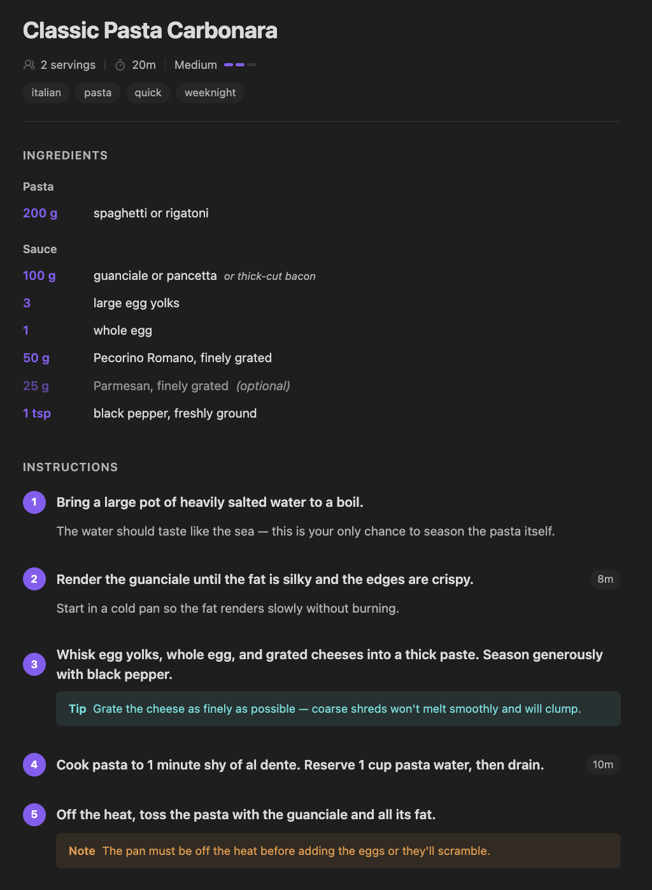
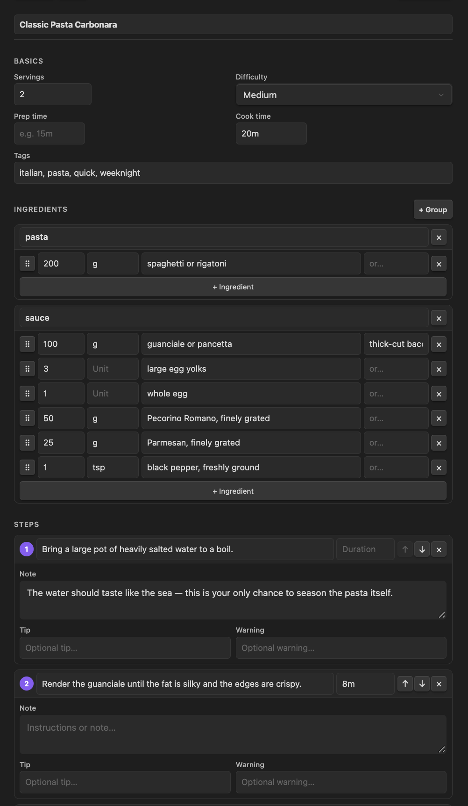
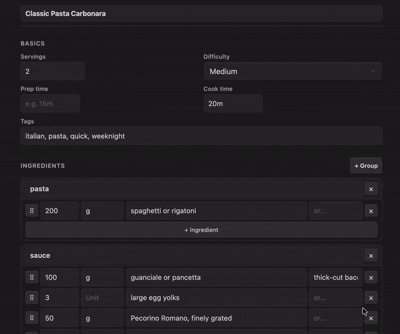

# Kaper

Rich UI for `kaper` recipe blocks inside Obsidian. Any ` ```kaper ` fenced YAML block in your notes renders as a structured recipe — preview and form editor — while the surrounding markdown stays as regular Obsidian prose.

Companion to the [Kaper](https://kaper.me) web app. Files are interchangeable.



## Features

- **In-place rendering** — `kaper` code blocks become a rendered recipe view in Reading mode and Live Preview. Markdown around the block (notes, headings, links) is unaffected.
- **Preview** — title, servings, difficulty bars, tag pills, ingredient groups, numbered steps with tip/warning callouts. Styled with your Obsidian accent color so it adapts to any theme.
- **Form editor** — full editing for title, servings, difficulty, prep/cook time, tags, ingredient groups (add/remove), steps (add/remove/reorder, with note, tip, warning, technique, duration).
- **Auto-save** — debounced 1s. Form state, focus, and scroll position survive saves (the React tree is held across re-renders).
- **Cook Mode** — opens `kaper.me` in your browser to start the full Cook Mode experience on the web.
- **Ribbon button** — one click to create a new recipe in the active folder.



## File format

Recipes are markdown files containing a ` ```kaper ` YAML block. The YAML inside the fences is parsed; everything outside is rendered as normal markdown.

````markdown
A true Roman classic — no cream, no shortcuts.

```kaper
version: 1
title: Classic Pasta Carbonara
servings: 2
difficulty: medium
time:
  cook: 20m
tags: [italian, pasta, weeknight]
ingredients:
  pasta:
    - amount: 200
      unit: g
      name: spaghetti
  sauce:
    - amount: 100
      unit: g
      name: guanciale
      sub: pancetta
steps:
  - title: Bring a large pot of salted water to a boil.
    note: The water should taste like the sea.
  - title: Cook guanciale in a cold skillet until crispy.
    duration: 8m
    technique: Starting cold renders the fat without burning.
```

Tips and notes about the recipe go here as regular markdown.
````

Required fields: `title`, `servings`, `ingredients`, `steps`. Unknown top-level keys (e.g. `nutrition:`, `wine:`) are preserved on save for forward compatibility.

## Usage



- **Create a recipe** — click the utensils icon in the left ribbon, or run **Kaper: Create recipe** from the command palette.
- **View** — open any markdown file with a `kaper` block. In Reading mode or Live Preview (cursor outside the block) it renders as a recipe.
- **Edit** — switch to the **Form** tab inside the rendered block. Changes write back to the YAML automatically.
- **Edit raw YAML** — switch to Source mode, or click inside the code block in Live Preview.

## Installation

### Community Plugins

_Pending submission to the Obsidian Community Plugin registry._

### Manual

1. Download `main.js`, `manifest.json`, and `styles.css` from the latest GitHub release.
2. Copy them into `<your-vault>/.obsidian/plugins/kaper/`.
3. In Obsidian: Settings → Community plugins → enable **Kaper**.

### Development

```bash
git clone <this-repo>
cd obsidian-kaper
npm install
npm run dev    # watch mode → main.js
```

Symlink the repo into a test vault:

```bash
ln -s "$PWD" "/path/to/test-vault/.obsidian/plugins/kaper"
```

Run tests:

```bash
npm test
```

## License

MIT — see [LICENSE](LICENSE).
